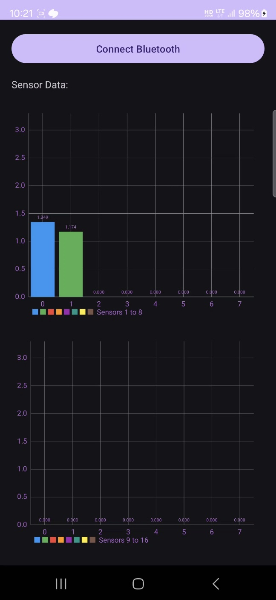

# 🩺 생체 신호 실시간 모니터링 시스템 어플리케이션  
블루투스 기반의 생체 신호 실시간 모니터링 어플리케이션입니다. 이 시스템은 블루투스 통신을 통해 원시 데이터를 수신하고, 이를 전압 값으로 변환한 뒤, 동적인 실시간 그래프 형태로 시각화합니다.

---

## 🚀 주요 기능  
- 📡 **블루투스 통신:** 외부 센서로부터 원활한 데이터 전송
- 📊 **실시간 그래프:** 생체 신호 변화를 즉시 시각화 (센서 값 최대 16개까지 지원)
- ⚙️ **데이터 변환:** 원시 입력 값을 읽기 쉬운 전압 값으로 변환  
- 📱 **사용자 친화적 인터페이스:** 효율적인 모니터링을 위한 직관적 디자인  
---

## 🔧 기술 스택  
- **하드웨어:** 블루투스 기반 센서 장치 *(협력: 창원대학교, KAIST)*  
- **소프트웨어:** 안드로이드 앱, 블루투스 API *(개발: 직접 구현, Android Studio)*  
- **개발 언어:** Java  

---

## 🌟 활용 사례  
- 🏥 **건강 모니터링:** 환자 생체 신호 실시간 추적  
- 🔬 **의료 연구:** 데이터 기반 분석 및 연구 지원  
- 📲 **IoT 기반 웨어러블 시스템:** 스마트 디바이스와 연동  

---

## 📷 스크린샷  
 

---

## ⚙️ 설치 방법  
1. 레포지토리 클론  
```bash
git clone https://github.com/JunYBae/Biological-Signal-Real-Time-Monitoring-System-Application.git
```
## 📚 사용 메뉴얼

PDF 문서를 다운로드하여 자세한 내용을 확인해보세요:

[](menual.pdf)
